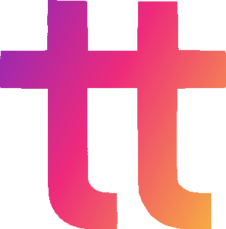

<!-- PROJECT LOGO -->
 

  

<h3 align="center"><b>teatype</b></h3>

  

    Useful utility classes & more <i>(there isn't more)</i>. TypeScript and Python support.
     
    <a href="https://github.com/arsonite/teatype/issues">Report Bug</a>
    ·
    <a href="https://github.com/arsonite/teatype/issues">Request Feature</a>
  

<!-- TABLE OF CONTENTS -->

Table of Contents

<ol>
  <li><a href="#high-priority-to-dos">High-Priority TO-DOs</a></li>
  <li><a href="#contributing">Contributing</a></li>
  <li><a href="#license">License</a></li>
  <li><a href="#contact">Contact</a></li>
</ol>

(<a href="#readme-top">back to top</a>)

### Built With

-   [![Python][Python]][Python-url]
-   [![TypeScript][TypeScript]][TypeScript-url]

(<a href="#readme-top">back to top</a>)

<!-- PRIORITY TO-DO -->

## High-Priority TO-DOs

(<a href="#readme-top">back to top</a>)

<!-- CONTRIBUTING -->

## Contributing

Contributions are what make the open source community such an amazing place to learn, inspire, and create. Any contributions you make are **greatly appreciated**.

If you have a suggestion that would make this better, please fork the repo and create a pull request. You can also simply open an issue with the tag "enhancement".
Don't forget to give the project a star! Thanks again!

1. Fork the Project
2. Create your Feature Branch (`git checkout -b feature/AmazingFeature`)
3. Commit your Changes (`git commit -m 'Add some AmazingFeature'`)
4. Push to the Branch (`git push origin feature/AmazingFeature`)
5. Open a Pull Request

(<a href="#readme-top">back to top</a>)

<!-- LICENSE -->

## License

Distributed under MIT license. See `LICENSE` for more information.

(<a href="#readme-top">back to top</a>)

<!-- CONTACT -->

## Contact

Project Link: [https://github.com/arsonite/teatype](https://github.com/arsonite/teatype)

(<a href="#readme-top">back to top</a>)

<!-- MARKDOWN LINKS & IMAGES -->
<!-- https://www.markdownguide.org/basic-syntax/#reference-style-links -->

[product-screenshot]: images/screenshot.png
[Python]: https://img.shields.io/badge/Python-20232A?style=for-the-badge&logo=python&logoColor=3178C6
[python-url]: https://www.python.org/
[TypeScript]: https://img.shields.io/badge/TypeScript-20232A?style=for-the-badge&logo=typescript&logoColor=3178C6
[TypeScript-url]: https://www.typescriptlang.org/
